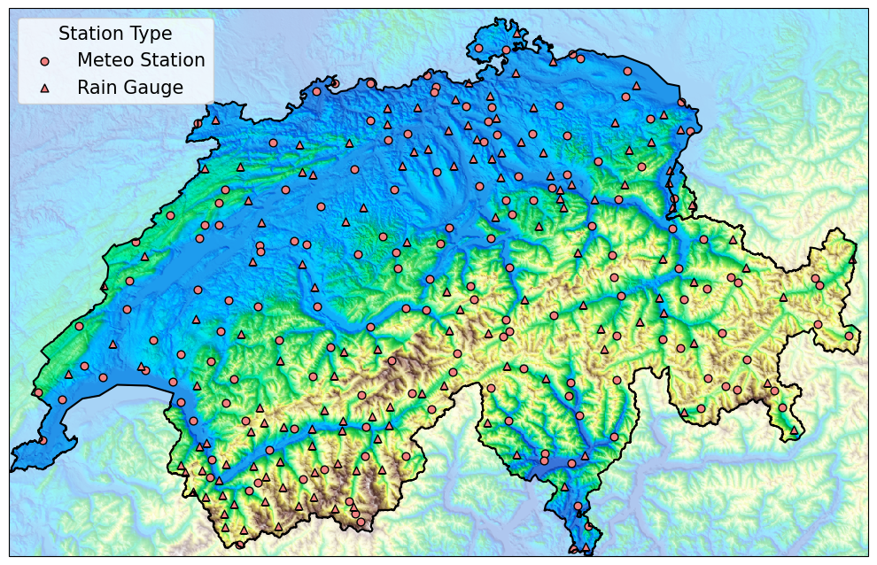
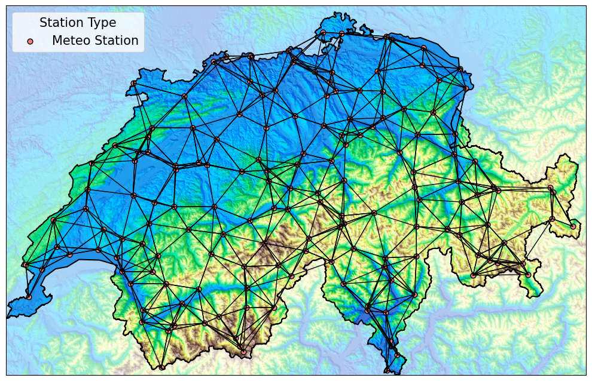

# PeakWeather

This repository contains the code to load and preprocess the PeakWeather dataset. The dataset is hosted on Hugging Face 

> [https://huggingface.co/datasets/MeteoSwiss/PeakWeather](https://huggingface.co/datasets/MeteoSwiss/PeakWeather)

and presented in the paper

> **PeakWeather: MeteoSwiss Weather Station Measurements for Spatiotemporal Deep Learning**  
> *Daniele Zambon², Michele Cattaneo¹, Ivan Marisca², Jonas Bhend¹, Daniele Nerini¹, Cesare Alippi² ³*  
> ¹ MeteoSwiss, ² USI, IDSIA, ³ PoliMi


<div style="display: flex; justify-content: center; gap: 20px;">
  
  
</div>

## Quickstart:

### Install 

#### Option 1: Clone and install locally

```shell
git clone https://github.com/MeteoSwiss/PeakWeather.git 
cd PeakWeather
pip install .                # Without extras
pip install .[topography]    # Install with extras
```

#### Option 2: Install via pip as a package

```shell
pip install git+https://github.com/MeteoSwiss/PeakWeather.git # Install normal package
pip install "peakweather[topography] @ git+https://github.com/MeteoSwiss/PeakWeather@main" # Install with extras
```

### Download the data from Hugging Face

```python
from peakweather.dataset import PeakWeatherDataset
# Download the data in the current working directory
ds = PeakWeatherDataset(root=None)
```

### Load pre-downloaded data

```python
from peakweather.dataset import PeakWeatherDataset
ds = PeakWeatherDataset(root=<PATH_TO_DATA>)
```

### Get observations

```python
# For a single station, all parameters
ds.get_observations(stations='KLO') 
# For two stations, all parameters
ds.get_observations(stations=['KLO', 'GRO']) 
# For specific parameters
ds.get_observations(stations='KLO', parameters=['pressure', 'temperature']) 
```

| datetime                  |   ('KLO', 'pressure') |   ('KLO', 'temperature') |
|:--------------------------|----------------------:|-------------------------:|
| 2017-01-01 00:00:00+00:00 |                 977.8 |                     -3.3 |
| 2017-01-01 00:10:00+00:00 |                 977.7 |                     -3.5 |
| 2017-01-01 00:20:00+00:00 |                 977.6 |                     -3.5 |
| 2017-01-01 00:30:00+00:00 |                 977.5 |                     -3.6 |
| 2017-01-01 00:40:00+00:00 |                 977.3 |                     -3.5 |
...

```python
# Get observations for a specific time frame
ds.get_observations(stations='KLO', 
                    parameters=['wind_speed', 'wind_direction'], 
                    first_date=pd.Timestamp('2024-08-01 16:32'),
                    last_date=pd.Timestamp('2024-08-01 17:26'))

```

| datetime                  |   ('KLO', 'wind_speed') |   ('KLO', 'wind_direction') |
|:--------------------------|------------------------:|----------------------------:|
| 2024-08-01 16:40:00+00:00 |                     3.9 |                         219 |
| 2024-08-01 16:50:00+00:00 |                     2.5 |                         225 |
| 2024-08-01 17:00:00+00:00 |                     2.9 |                         231 |
| 2024-08-01 17:10:00+00:00 |                     3.1 |                         259 |
| 2024-08-01 17:20:00+00:00 |                     2.8 |                         237 |


## Detailed Usage

For detailed usage and parameter descriptions, please refer to the docstring of the `PeakWeatherDataset` class, which provides extended documentation on its functionality and options.

### Re-sampling
```python
ds = PeakWeatherDataset(
        root="data",  # Path to the dataset
        pad_missing_variables=True,  # Pad missing variables with NaN
        years=None,  # Years to include in the dataset (None for all)
        parameters=None,  # Parameters to include in the dataset (None for all)
        extended_topo_vars="none",  # Optional extended topographic variables
        extended_nwp_vars="none",  # Optional extended NWP model (ICON) variables
        imputation_method="zero",  # Method for imputing missing values
        freq="h",  # Frequency of the data (e.g., "h" for hourly)
        compute_uv=True,  # Compute u and v components of wind
        station_type="meteo_station",  # Which station type to load (None for all)
        aggregation_methods={'temperature': 'mean'} # Use specific aggregation
    )

```

The above dataset is initialized with hourly frequency. The 10-minute values are aggregated with the default methods below:

| name           | aggregation   |
|:---------------|:--------------|
| humidity       | last          |
| precipitation  | sum           |
| pressure       | last          |
| sunshine       | sum           |
| temperature    | last          |
| wind_direction | mean          |
| wind_gust      | max           |
| wind_speed     | mean          |
| wind_u         | mean          |
| wind_v         | mean          |

Notice, however, how we can change the aggregation method with the `aggregation_methods` argument. In this case, the temperature will be averaged over the previous hour.

### Basic information 

We can obtain some basic information about the content of the dataset as follows:

```python
# Get printable representation of the dataset
print(ds)

# Show dataset information
print(f"Number of time steps: {ds.num_time_steps}")

print(f"Number of stations: {ds.num_stations}")
print(ds.stations_table.head(10))

print(f"Number of parameters: {ds.num_parameters}")
print(f"Parameters")
ds.show_parameters_description()

# Show data
print(f"Observations shape: {ds.observations.shape}")
print(ds.observations.head(10))

# Show the amount of missing values considering stations 
# equipped with the respective sensor
print(ds.missing_values)
```

We can get observations for a specific station and parameter as arrays:

```python

# Get wind gust and direction for station KLO
klo_data = ds.get_observations(stations="KLO",
                                parameters=["wind_gust", "wind_direction"],
                                as_numpy=True)

print(f"KLO data shape: {klo_data.shape}")
print(f"KLO maximum wind gust: {klo_data[..., 0].max():.2f} m/s")
```

### Time series windowing 

We can obtain the data for a sliding window of a size $W$ and horizon $H$.

```python
window_size = 12
lead_times = 3
sub_windows = ds.get_windows(window_size=window_size,
                                horizon_size=lead_times,
                                stations=ds.stations[:10],
                                parameters=["wind_speed", "wind_direction"],
                                first_date="2020-01-01",
                                last_date="2022-01-01")
print(f"Windows x shape: {sub_windows.x.shape}")
print(f"Windows mask_x shape: {sub_windows.mask_x.shape}")
print(f"Windows y shape: {sub_windows.y.shape}")
print(f"Windows mask_y shape: {sub_windows.mask_y.shape}")
```

The object returned contains `x` of shape $[\text{windows}, W,\text{stations}, \text{params}]$ and `mask_x` of the same shape, representing the input windows. Associated with them, there are `y` and `mask_y` of shape $[\text{windows}, H,\text{stations}, \text{params}]$ representing the future quantities.
