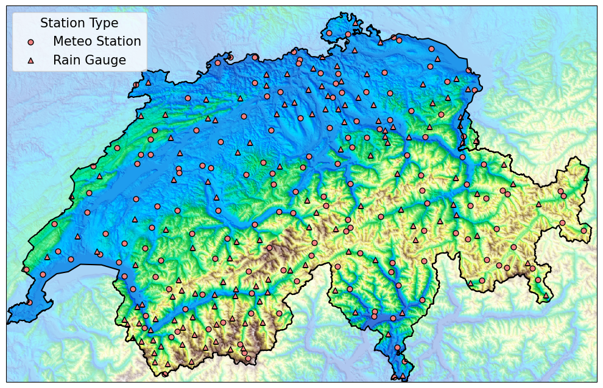

.. PeakWeather documentation master file, created by
   sphinx-quickstart on Tue Jun 24 21:18:50 2025.
   You can adapt this file completely to your liking, but it should at least
   contain the root `toctree` directive.

PeakWeather
=========================

**PeakWeather** is a high-resolution, benchmark-ready **dataset** for spatiotemporal weather modeling. 

Key Features
------------

- **High-resolution observations**: 10-minute interval data spanning 2017-2025 over 302 SwissMetNet stations distributed across Switzerland
- **Multiple variables**: Temperature, pressure, humidity, wind, radiation, precipitation and more
- **Topographic descriptors**: Elevation, slope, aspect, and surface roughness to describe the Swiss complex terrain
- **NWP baselines**: Ensemble forecasts from ICON-CH1-EPS, the state-of-the-art numerical prediction model operational at MeteoSwiss
- **Support to different tasks**: including time series forecasting, missing data imputation, virtual sensing, graph structure learning

Related Resources
-----------------

- **Dataset** access on **Hugging Face**:   
   | https://huggingface.co/datasets/meteoswiss/PeakWeather
- **GitHub** repository of the **library**: 
   | https://github.com/meteoswiss/peakweather
- **Paper** introducing the dataset: 
   | PeakWeather: MeteoSwiss Weather Station Measurements for Spatiotemporal Deep Learning.
   | *Daniele Zambon, Michele Cattaneo, Ivan Marisca, Jonas Bhend, Daniele Nerini, Cesare Alippi.*
   | Preprint 2025.
   | https://arxiv.org/abs/2506.13652
- **Code for an application to wind forecasting**: 
   | https://github.com/Graph-Machine-Learning-Group/peakweather-wind-forecasting
- Read the Docs **documentation**: 
   | https://peakweather.readthedocs.io/

Quickstart
----------

Install the dataset library. The base package handles the station measurements and the NWP predictions. It can be install by running the following command 

.. code-block:: bash

   pip install git+https://github.com/MeteoSwiss/PeakWeather.git # Install base package

If access to the topographical descpitors is desired, then there are additional required libraries that can be installed via

.. code-block:: bash
   
   pip install "peakweather[topography] @ git+https://github.com/MeteoSwiss/PeakWeather@main" # Install with extras

When the `PeakWeatherDataset` is instanciated for the first time, the weather data is downloaded.

.. code-block:: python

   from peakweather.dataset import PeakWeatherDataset
   # Download the data in the current working directory
   ds = PeakWeatherDataset(root=<PATH_TO_DATA>)

For detailed usage and parameter descriptions, please refer to `documentation <modules/index.html>`_ of the PeakWeatherDataset class, which provides extended documentation on its functionality and options.

Citation
--------

If you use PeakWeather in your research, please cite:

.. code-block:: bibtex

   @misc{zambon2025peakweather,
      title={PeakWeather: MeteoSwiss Weather Station Measurements for Spatiotemporal Deep Learning}, 
      author={Zambon, Daniele and Cattaneo, Michele and Marisca, Ivan and Bhend, Jonas and Nerini, Daniele and Alippi, Cesare},
      year={2025},
      eprint={2506.13652},
      archivePrefix={arXiv},
      primaryClass={cs.LG},
      url={https://arxiv.org/abs/2506.13652}, 
   }

Documentation
-------------

.. toctree::
   :maxdepth: 2
   :caption: Examples

   examples/peakweather_demo

.. toctree::
   :maxdepth: 2
   :caption: API

   modules/index
   genindex

